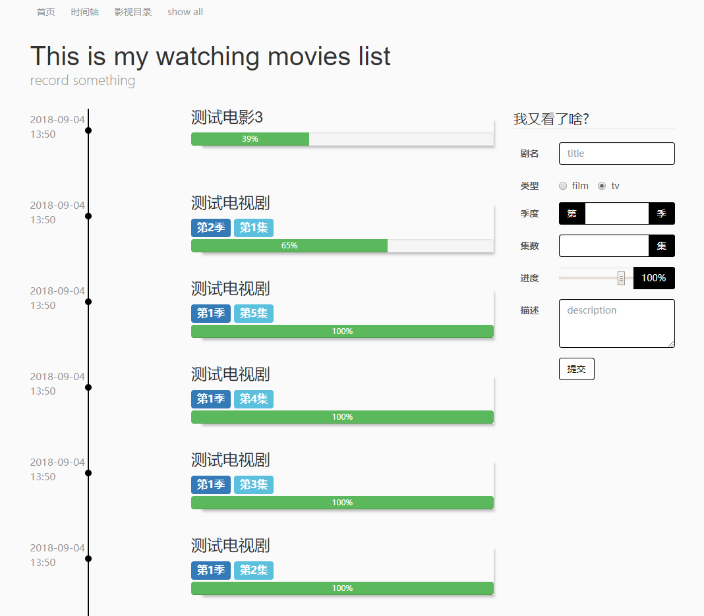

movie-axis
=============

我的观影时间轴,记录在什么时间,看了什么电影或者电视剧

目前功能点:
- 记录看过的电影,电视
- 以时间轴呈现
- 流加载数据

Screenshots
------------
时间轴主页

Todo
-------
- [x] ~~流加载数据~~
- [x] ~~自动完成输入框提示~~
- [ ] 按日期分类
- [ ] 按类型分类
- [ ] 单独页面显示所有看过的电影,电视
- [ ] 每个看过的剧详情页附带各个时间

